<!-- PROJECT LOGO -->
<br />
<p align="center">
  <h3 align="center">timeoff-management-deploy-traditional</h3>

  <p align="center">
    CI/CD Pipeline to deploy/update timeoff-management app using Cloudformation, CodeBuild and CodeDeploy.
</p>


<!-- TABLE OF CONTENTS -->
<details open="open">
  <summary>Table of Contents</summary>
  <ol>
    <li>
      <a href="#about-the-project">About The Project</a>
      <ul>
        <li><a href="#built-with">Built With</a></li>
      </ul>
    </li>
    <li>
      <a href="#getting-started">Getting Started</a>
      <ul>
        <li><a href="#prerequisites">Prerequisites</a></li>
        <li><a href="#architecture-diagrams-of-the-solution">Architecture diagrams of the solution</a></li>
      </ul>
    </li>
    <li><a href="#steps-to-deploy-the-solution">Steps to deploy the solution</a></li>
    <li><a href="#general-explanation">General explanation</a></li>
  </ol>
</details>


<!-- ABOUT THE PROJECT -->
## About The Project

This repo contains the steps and the code needed to deploy the infrastructure and componentes needed to deploy the timeoff-management app. It can be reproduced if the guide is followed strictly.

### Built With

This section should list any major frameworks that you built your project using. Leave any add-ons/plugins for the acknowledgements section. Here are a few examples.
* [timeoff-management-application](https://github.com/timeoff-management/timeoff-management-application)
* [AWS Cloudformation]
* [AWS CodeDeploy]
* [AWS CodeBuild]
* [Other Services: AWS SSM, S3, AWS CloudWatch]


<!-- GETTING STARTED -->
## Getting Started

### Prerequisites

- Fork the timeoff-management-application to your repositories to work from a feature/branch for the source-control deploy.

- aws cli V2.0

- An additional subnet if the default vpc is used.

- Nat gateway for the EC2 instances to access internet (download and install packages).

- 2 adittional routes for each subnet to access the internet: adding the entry 0.0.0.0/0 and link it to the previously created NAT Gateway.

- Link previously created routes to the private subnets.

- If public acess needed create an additional subnet and allow internet access with an InternetGateway.

- IAM user with proper permissions to use the CLI (AWS ACCESS KEY ID AND SECRET ACESS KEY).

- Personal access token from github (ref:https://docs.github.com/en/github/authenticating-to-github/creating-a-personal-access-token)

### Architecture diagrams of the solution
1.  Infrastructure to host the app

<p align="center">
  <a href="https://github.com/jfr992/timeoff-management-aws">
    
  </a>
</p>

2.  Pipeline to deploy infrastructure

<br />
<p align="center">
  <a href="https://github.com/jfr992/timeoff-management-aws">
    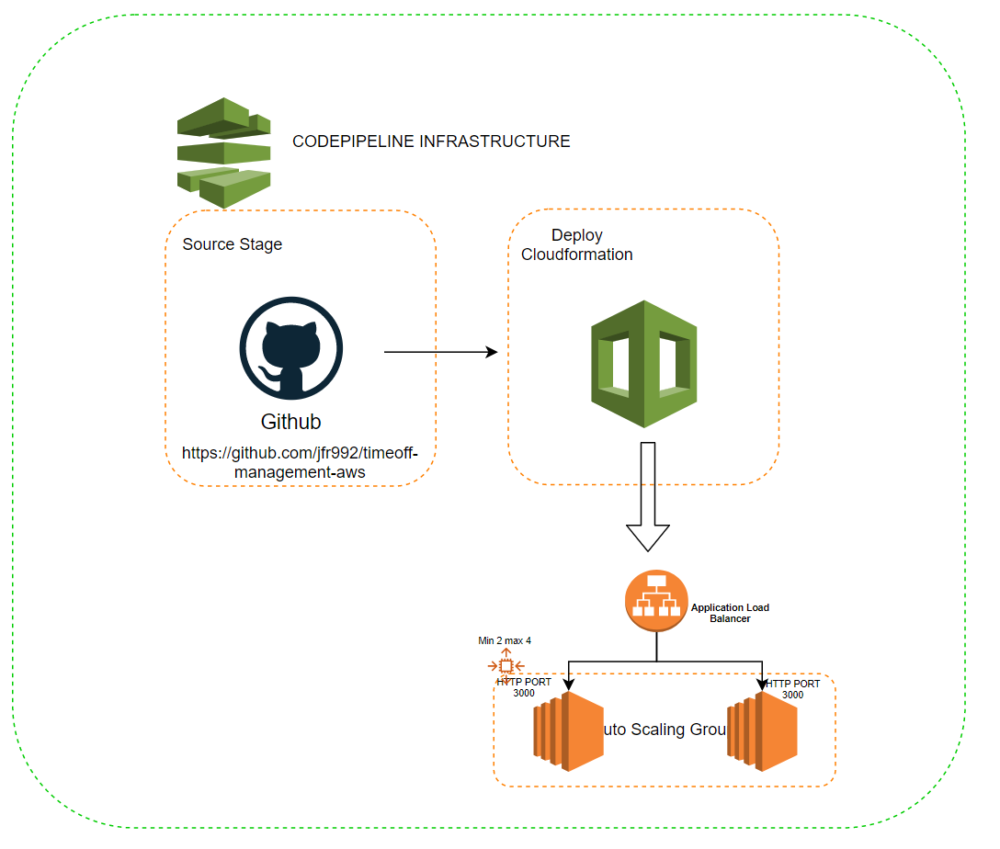
  </a>
</p>

3.  CI/CD deployment

<br />
<p align="center">
  <a href="https://github.com/jfr992/timeoff-management-aws">
    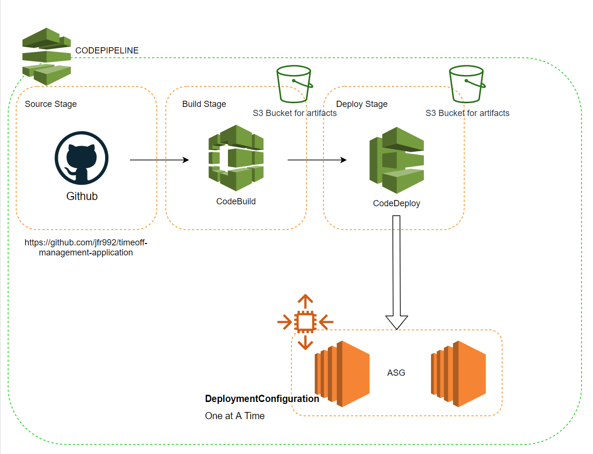
  </a>
</p>

### Steps to deploy the solution

1. Create the additional resources mentioned in pre-requisites section with aws cli or management console.

2. Configure AWS CLI to access your account.
   ```sh
   aws configure
   ```
3. Create self signed cert and create an IAM Server certificate for ALB (it could be a certificate from ACM but is more expensive).
   ```sh
   openssl req -x509 -nodes -days 365 -newkey rsa:2048 -keyout timeoff.key -out timeoff.crt
   openssl rsa -in timeoff.key -text > time-off-private.pem
   openssl x509 -inform PEM -in timeoff.crt > time-off-private-public.pem

   aws iam upload-server-certificate --server-certificate-name timeoff --certificate-body file://time-off-private-public.pem --private-key file://time-off-private.pem
   ```
4. Create or update an AWS Secret for the github access token.
   ```sh
   aws secretsmanager create-secret --name githubaccess-token --secret-string '{"token":"<PERSONALTOKENHERE>"}' --region <REGION-HERE>
   ```
5. Deploy the previous infrastructure using AWS CLI and cloudformation
   ```sh
   aws cloudformation create-stack --stack-name previous-infrastructure --template-body file://path/to/previous-infrastructure.yaml --parameters file://previous-infrastructure.json --capabilities CAPABILITY_IAM
   ```
  Wait for the stack to get in CREATE_COMPLETE STATE

  <p align="center">
    <a href="https://github.com/jfr992/timeoff-management-aws">
      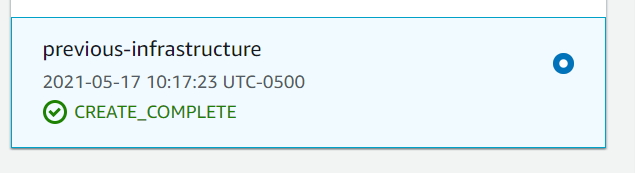
    </a>
  </p>

6. After the stacks is deployed, the infrastructure pipeline triggers the creation of the infrastructure stack to host the timeoff-management app (see architecture diagram)

  <p align="center">
    <a href="https://github.com/jfr992/timeoff-management-aws">
      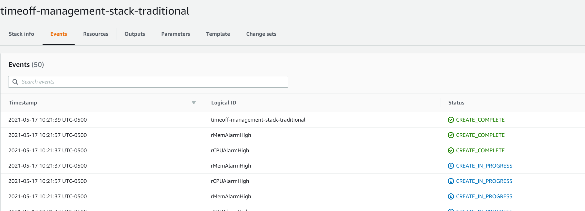
    </a>
  </p>

  Wait for the EC2 instances to get in a healthy state:

  <p align="center">
    <a href="https://github.com/jfr992/timeoff-management-aws">
      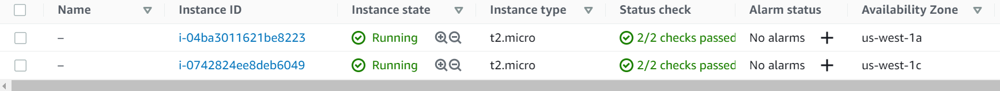
    </a>
  </p>

7. Deploy the app deploy stack using AWS CLI and cloudformation

   ```sh
   aws cloudformation create-stack --stack-name app-deploy --template-body file:///path/to/app-deploy.yaml --parameters file:///path/toapp-deploy.json --capabilities CAPABILITY_IAM
   ```
  
  Wait for the stack to be in CREATE_COMPLETE STATE

  <p align="center">
    <a href="https://github.com/jfr992/timeoff-management-aws">
      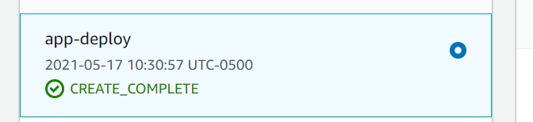
    </a>
  </p>

8. After the stacks is deployed, the app pipeline triggers the deployment of the timeoff-management app to the ec2 instances.

    <div class="row">
      <div class="column">
        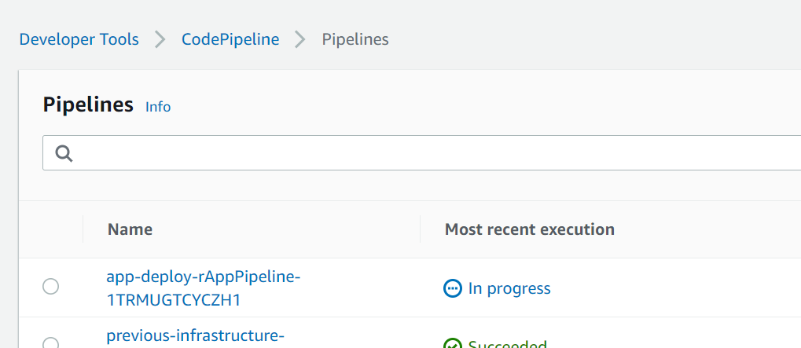
      </div>
      <div class="column">
        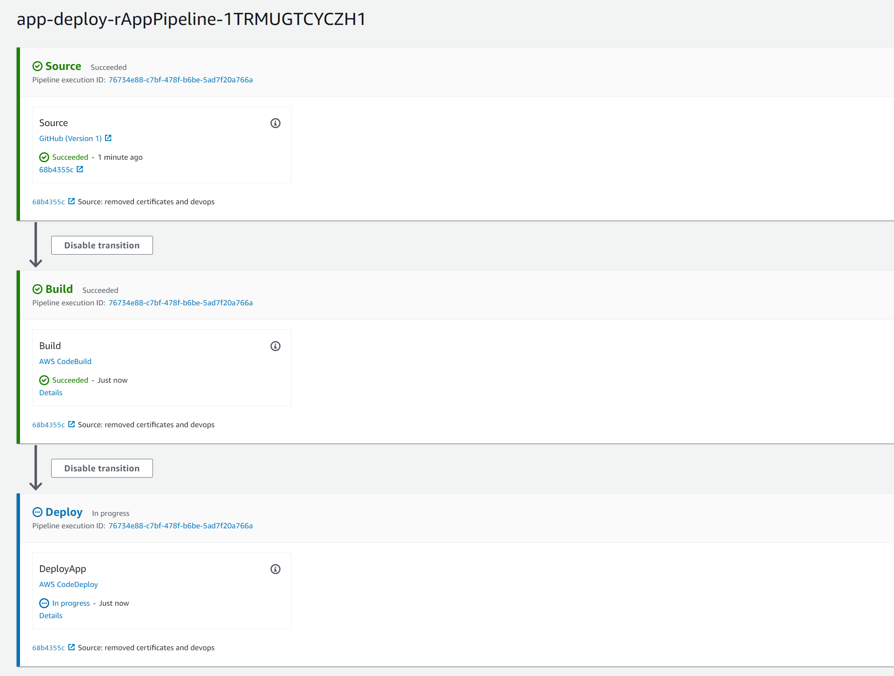
      </div>
      <div class="column">
        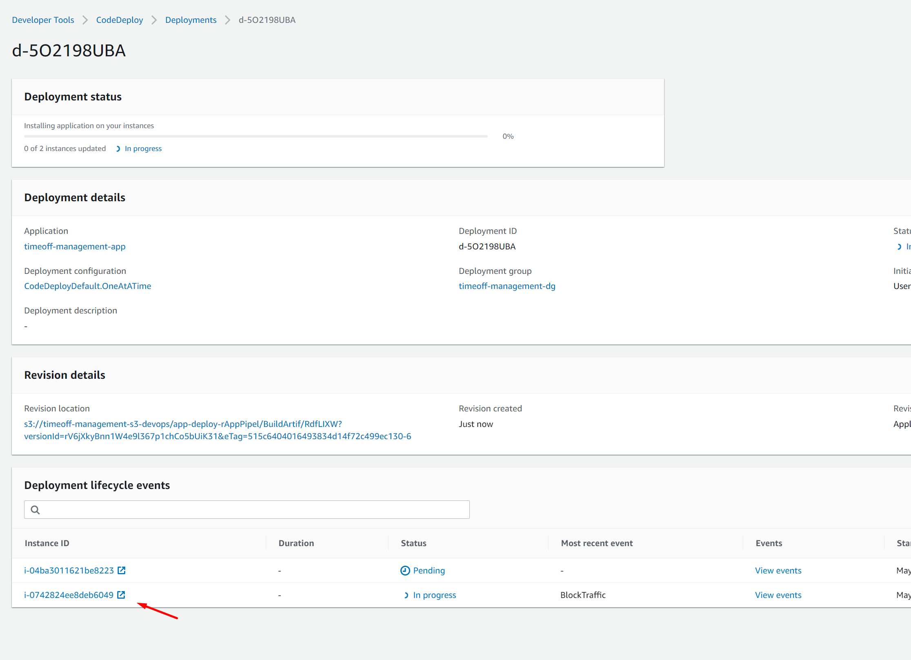
      </div>
    </div>

9. Wait for CodeDeploy to update the app on each instance, and check that the target groups are in healthy state:

    <div class="row">
      <div class="column">
        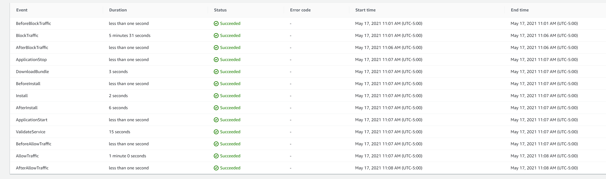
      </div>
      <div class="column">
        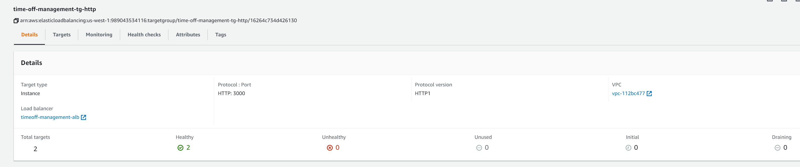
      </div>
      <div class="column">
        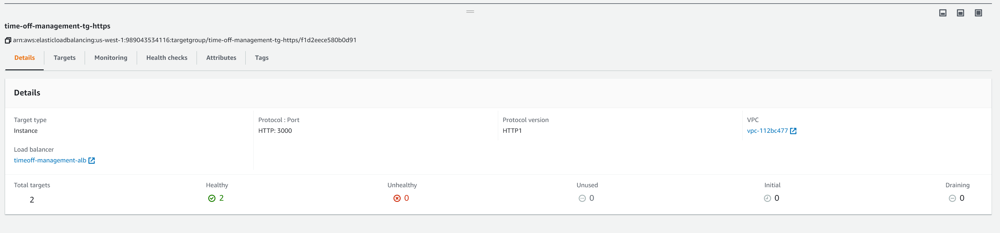
      </div>
    </div>


<!--General explanation -->
## General explanation

This project was developed to solve the challenge of having a highly available application (timoff-management), and its CI/CD life cycle is fully met (SLDC).
Several AWS Resources and components were used to achieve this goal:

- AWS CloudFormation
- AWS CodeBuild
- AWS CodePipeline
- AWS CodeDeploy
- AWS EC2 (AutoScaling,ELB)
- S3

 ### How it Works?

With the template **previous-infrastructure.yaml** 5 resources are deployed:

1. rS3artifacts: S3 Bucket to store the artifacts in the app pipeline.
2. rInfrastructurepipeline: Pipeline to deploy the infrastructure needed for the app using a deploy stage invoking Cloudformation.
3. rGITwebhook: GitHub WebHook to connect the pipeline Source Stage with Github with a personal access token.
4. rcodepipelineServiceRole: IAM service role for CodePipeline (the permissions right know are wide open).
5. rcfnServiceRole: Cloudformation service role (the permissions right know are wide open).

After the pipeline gets deployed via Cloudformation, the infrastructure of the timeoff-application gets deployed using the **infrastructure-traditional.yaml** template, this stacks is made up of several resources, below the detailed explanation:

Note: The parameters are received from the json file **previous-infrastructure.json**.

1. rSecurityGroupALB: Security group for ALB, it has access to ports 443 and 80 from only the CIDR of the VPC.
2. rSecurityGroup: Security group for the ec2 instances , it has access to port 3000.
3. rIamProfile: Iam Profile for the resource rLaunchConfig.
4. rRole: Iam Role with permissions to s3 (to access the artifacts of Codepipeline), ssm (to acess the instances with session manager)
5. rLaunchConfig: Launch configuration that contains the script that is executed when the instances start (bootstrap script or userdata), also the amiId and the      instance type are parameters of the cfn template.
    ```sh
    #!/bin/bash -x
    export PATH=~/.local/bin:/$PATH
    yum update -y 
    yum install python3.7 -y
    #install aws-cli
    yum erase awscli -y
    cd /home/ec2-user
    echo "export PATH=.local/bin:$PATH" >> .bash_profile
    cd /home/ec2-user
    wget https://bootstrap.pypa.io/get-pip.py
    su -c "python3.7 get-pip.py --user" -s /bin/sh ec2-user
    su -c "/home/ec2-user/.local/bin/pip3 install boto3 --user" -s /bin/sh ec2-user
    su -c "/home/ec2-user/.local/bin/pip3 install awscli --user" -s /bin/sh ec2-user
    
    #install node
    yum install -y gcc-c++ make
    curl -sL https://rpm.nodesource.com/setup_12.x | sudo -E bash -
    yum install -y nodejs 
    #git install
    yum -y install git
    #code deploy agent install
    yum install -y ruby
    wget https://aws-codedeploy-eu-west-1.s3.eu-west-1.amazonaws.com/latest/install
    chmod +x ./install
    ./install auto
    service codedeploy-agent status
    #phantomjs install
    yum -y install fontconfig freetype freetype-devel fontconfig-devel libstdc++
    wget https://bitbucket.org/ariya/phantomjs/downloads/phantomjs-1.9.8-linux-x86_64.tar.bz2
    mkdir -p /opt/phantomjs
    bzip2 -d phantomjs-1.9.8-linux-x86_64.tar.bz2
    tar -xvf phantomjs-1.9.8-linux-x86_64.tar \
        --directory /opt/phantomjs/ --strip-components 1
    ln -s /opt/phantomjs/bin/phantomjs /usr/bin/phantomjs
    #install chrome-driver
    cd /tmp/
    wget https://chromedriver.storage.googleapis.com/80.0.3987.106/chromedriver_linux64.zip
    unzip chromedriver_linux64.zip
    mv chromedriver /usr/bin/chromedriver
    #Install initial version of app
    #git clone https://github.com/timeoff-management/application.git /var/timeoff-management
    #cd /var/timeoff-management
    #npm install
    #nohup /usr/bin/npm --prefix /var/timeoff-management/ run start </dev/null &>/dev/null &
    ```
6. rAutoScalingGroup: AutoScaling group that can spawn the instances in 2 AZ's, it also has the HTTP and HTTPS target groups parametrized.
7. rTargetTrackingScalingPolicy: scaling policy so that the Auto Scaling group can change the number of instances available for your application in response to changing demand.
8. rCPUScaleUpPolicy: scaling policy so that the Auto Scaling group can change the number of instances available for your application in response to changing demand. (CPU)
9. rMemScaleUpPolicy: scaling policy so that the Auto Scaling group can change the number of instances available for your application in response to changing demand. (Memory)
9. rCPUAlarmHigh: CW alarm for memory scaling policy.
10. rMemAlarmHigh: CW alarm for memory scaling policy.
11. rLoadBalancer: Application Load Balancer for the application, its internal (only can be accessed from the VPC).
12. rTargetGroupHTTPS: HTTPS Target group, it has a health check to the path /login/
13. rTargetGroupHTTP: HTTP Target group, it has a health check to the path /login/
14. rListenerSecure: Secure listener for port 443 (it uses the IAM server certificate).
15. rListenerNonSecure: Non secure listener for port 80.

Note: The parameters are received from the json file **infrastructure-traditional.json**, the structure is different because is deployed by CodePipeline.

Finally, with the template **app-deploy.yaml** the resources needed to build and deploy the app are created:

1. rAppPipeline: Pipeline that has 3 stages to deploy the application 
    
    --> Source (Github), the deployment is triggered everytime a change is made in the branch feature/jreyes
    --> Build (CodeBuild) using buildpsec.yml file located in the application repo. It does a basic test with the script calendar.js located in the application repo
    --> Deploy (CodeDeploy) using the appspec.yml file located in the application repo

2. rcodepipelineServiceRole: IAM Role for app pipeline (the permissions right know are wide open).
3. rcodeBuildProject: CodeBuild Project for the build stage, it has the configuration for compute type (where my code is going to be tested) and how is going to be   triggered (from a push from a specific branch).
4. rcodeBuildServiceRole: IAM Role for CodeBuild (the permissions right know are wide open).
5. rApplication: Application created to deploy the app.
6. rDeploymentGroup: Deployment group that has several configurations
   ```yaml
      DeploymentConfigName: 'CodeDeployDefault.OneAtATime' --> one instanced get the app deployed/updated at a time.
      DeploymentGroupName: 'timeoff-management-dg'
      AutoScalingGroups:
        - Ref: pAsgName
      LoadBalancerInfo:
        TargetGroupInfoList:
          - Name:
              Ref: pTargetGroupName
      DeploymentStyle:
        DeploymentOption: WITH_TRAFFIC_CONTROL
        DeploymentType: IN_PLACE --> Is not a BLUE/GREEN DEPLOYMENT ($$$)
    ```
7. rcodeDeployServiceRole: IAM Role for CodeDeploy (the permissions right know are wide open).
8. rGITwebhook: GitHub WebHook to connect the pipeline Source Stage with Github with a personal access token.
9. rCodeBuildSourceCredential: SourceCredential for the codebuild project resource (connection with github).

Note: The parameters are received from the json file **app-deploy.json**.

 ### Details about Build and deployment:

1. BUILD: buildspec.yml file

```yaml
 version: 0.2
phases:
  install:
    runtime-versions: 
      nodejs: 12 # NODE 12 is used (it wont work with 14)
    commands:
    - echo Installing node
  pre_build:
    commands:
      - npm install # Installs the nodejs app
  build:
    commands:
      - npm test # Unit test for the app(this was modified in the feature/jreyes branch in the file package.json "node node_modules/mocha/bin/mocha t/unit/calendar.js")
  post_build:
    commands:
      - echo Build completed on `date`
artifacts:
  files:
    - '**/*'
```
2. DEPLOYMENT: appspec.yml file

In the application repo (fork: https://github.com/jfr992/timeoff-management-application), theres a folder called **scripts** that contains 5 shell scripts for every hoook that is declared in the appspec.yml file, they are simple but effective.

  ```yaml
version: 0.0
os: linux
files:
  - source: /
    destination: /var/timeoff-management-application/
hooks:
  ApplicationStop:
    - location: scripts/stop_timeoff-management.sh ##stop the app 
      timeout: 300
      runas: root

  BeforeInstall:
    - location: scripts/remove_timeoff-management.sh ##remove the previous version
      timeout: 300
      runas: root

  AfterInstall:
    - location: scripts/install_timeoff-management.sh # installs the app dependencies
      timeout: 300
      runas: root

  ApplicationStart:
    - location: scripts/start_timeoff-management.sh # starts the up as a background process
      timeout: 300
      runas: root

  ValidateService:
    - location: scripts/validate_timeoff-management.sh # validate the service
      timeout: 300
      runas: root
  ```


