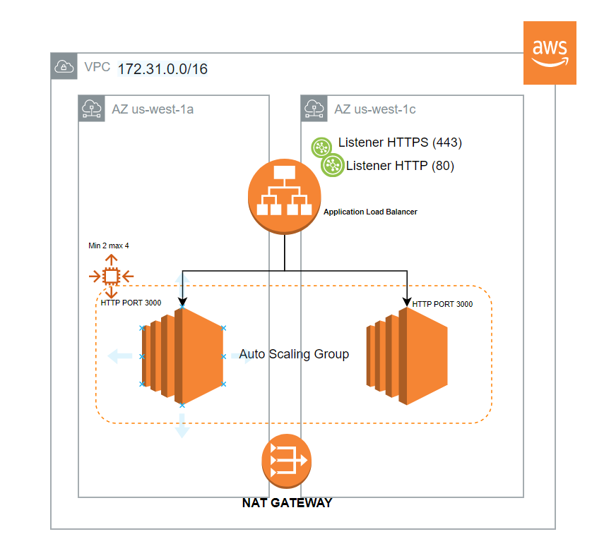

<!-- PROJECT LOGO -->
<br />
<p align="center">
  <a href="https://github.com/jfr992/timeoff-management-aws">
    
  </a>

  <h3 align="center">timeoff-management-deploy-traditional</h3>

  <p align="center">
    CI/CD Pipeline to deploy/update timeoff-management app using Cloudformation, CodeBuild and CodeDeploy.
</p>


<!-- TABLE OF CONTENTS -->
<details open="open">
  <summary>Table of Contents</summary>
  <ol>
    <li>
      <a href="#about-the-project">About The Project</a>
      <ul>
        <li><a href="#built-with">Built With</a></li>
      </ul>
    </li>
    <li>
      <a href="#getting-started">Getting Started</a>
      <ul>
        <li><a href="#prerequisites">Prerequisites</a></li>
        <li><a href="#architecture">Architecture of the solution</a></li>
      </ul>
    </li>
    <li><a href="#usage">Usage</a></li>
    <li><a href="#roadmap">Roadmap</a></li>
    <li><a href="#contributing">Contributing</a></li>
    <li><a href="#license">License</a></li>
    <li><a href="#contact">Contact</a></li>
    <li><a href="#acknowledgements">Acknowledgements</a></li>
  </ol>
</details>


<!-- ABOUT THE PROJECT -->
## About The Project

This repo contains the steps and the code needed to deploy the infrastructure and componentes needed to deploy the timeoff-management app. It can tbe reproduced if the guide is followed strictly.
### Built With

This section should list any major frameworks that you built your project using. Leave any add-ons/plugins for the acknowledgements section. Here are a few examples.
* [timeoff-management-application](https://github.com/timeoff-management/timeoff-management-application)
* [AWS Cloudformation]
* [AWS CodeDeploy]
* [AWS CodeBuild]
* [Other Services: AWS SSM, S3, AWS CloudWatch]


<!-- GETTING STARTED -->
## Getting Started

### Prerequisites

- Fork the timeoff-management-application to your repositories to work from a feature/branch for the source-control deploy.

- aws cli V2.0

- Create an additional subnet if the default vpc is used.

- Create a Nat gateway for the EC2 instances to access internet (download and install packages)

- Create 2 adittional routes for each subnet to access the internet: adding the entry 0.0.0.0/0 and linking it to the previously created NAT Gateway

- Link previously created routes to the private subnets

- If public acess needed create an additional subnet and allow internet access with an InternetGateway

- Create an IAM user with proper permissions to use the CLI (AWS ACCESS KEY ID AND SECRET ACESS KEY)

### Architecture of the solution
1. Infrastructure to host the app


<p align="center">
  <a href="https://github.com/jfr992/timeoff-management-aws">
    
  </a>
</p>

2. CI/CD deployment
<br />
<p align="center">
  <a href="https://github.com/jfr992/timeoff-management-aws">
    
  </a>
</p>

1. Clone the repo
   ```sh
   git clone https://github.com/jfr992/timeoff-management-aws.git
   ```
2. Install NPM packages
   ```sh
   npm install
   ```
4. Enter your API in `config.js`
   ```JS
   const API_KEY = 'ENTER YOUR API';
   ```


<!-- USAGE EXAMPLES -->
## Usage

Use this space to show useful examples of how a project can be used. Additional screenshots, code examples and demos work well in this space. You may also link to more resources.

_For more examples, please refer to the [Documentation](https://example.com)_


<!-- ROADMAP -->
## Roadmap

See the [open issues](https://https://github.com/jfr992/timeoff-management-aws/issues) for a list of proposed features (and known issues).


<!-- CONTRIBUTING -->
## Contributing

Contributions are what make the open source community such an amazing place to be learn, inspire, and create. Any contributions you make are **greatly appreciated**.

1. Fork the Project
2. Create your Feature Branch (`git checkout -b feature/AmazingFeature`)
3. Commit your Changes (`git commit -m 'Add some AmazingFeature'`)
4. Push to the Branch (`git push origin feature/AmazingFeature`)
5. Open a Pull Request


<!-- LICENSE -->
## License

Distributed under the MIT License. See `LICENSE` for more information.


<!-- CONTACT -->
## Contact

Your Name - [@your_twitter](https://twitter.com/your_username) - email@example.com

Project Link: [https://github.com/your_username/repo_name](https://github.com/your_username/repo_name)


<!-- ACKNOWLEDGEMENTS -->
## Acknowledgements
* [GitHub Emoji Cheat Sheet](https://www.webpagefx.com/tools/emoji-cheat-sheet)
* [Img Shields](https://shields.io)
* [Choose an Open Source License](https://choosealicense.com)
* [GitHub Pages](https://pages.github.com)
* [Animate.css](https://daneden.github.io/animate.css)
* [Loaders.css](https://connoratherton.com/loaders)
* [Slick Carousel](https://kenwheeler.github.io/slick)
* [Smooth Scroll](https://github.com/cferdinandi/smooth-scroll)
* [Sticky Kit](http://leafo.net/sticky-kit)
* [JVectorMap](http://jvectormap.com)
* [Font Awesome](https://fontawesome.com)

